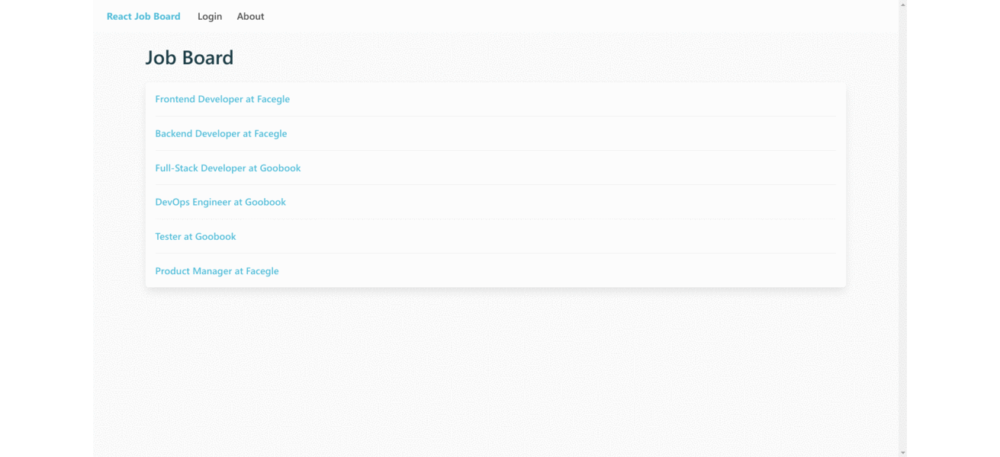

# GraphQL Job Board

> A simple Job Board app built with React & GraphQL.

<h2 align="center">
  
  <br>
</h2>

## Installation & Usage

### Install Dependencies & Run (client & server)

```
# Run client (:3000)
cd client
npm install
npm start

# Run server (:9000)
cd server
npm install
npm start

# Run frontend (:3000) & backend (:9000)
cd server
npm run dev
```

### Database

This application uses ```notarealdb``` instead of real databases. You can modify or add new users, companies and jobs in server/data folder.

```
Sample User Logins

alice@facegle.io
alice123

bob@goobook.co
bob123
```
